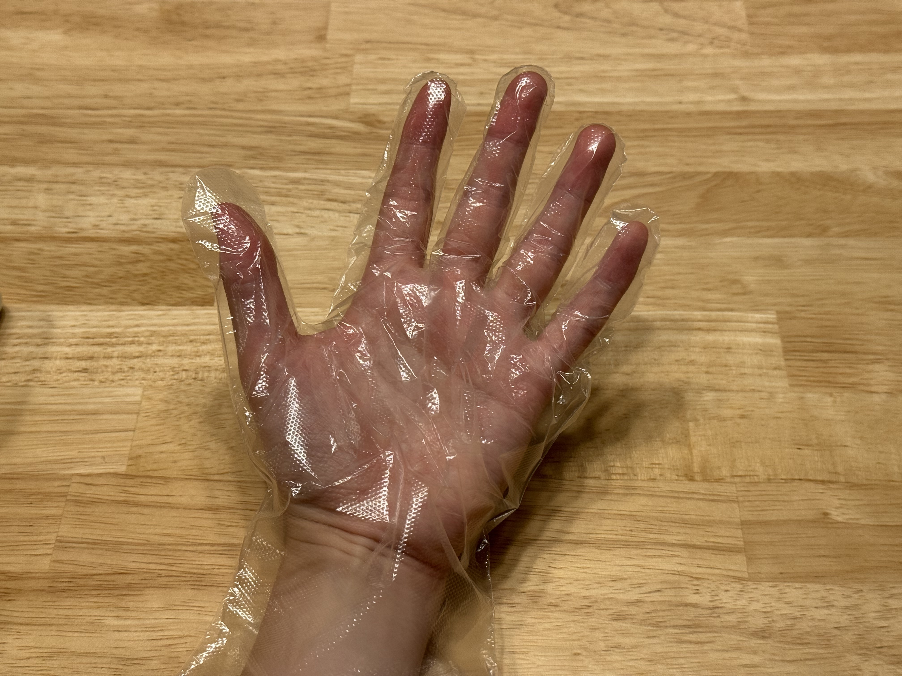
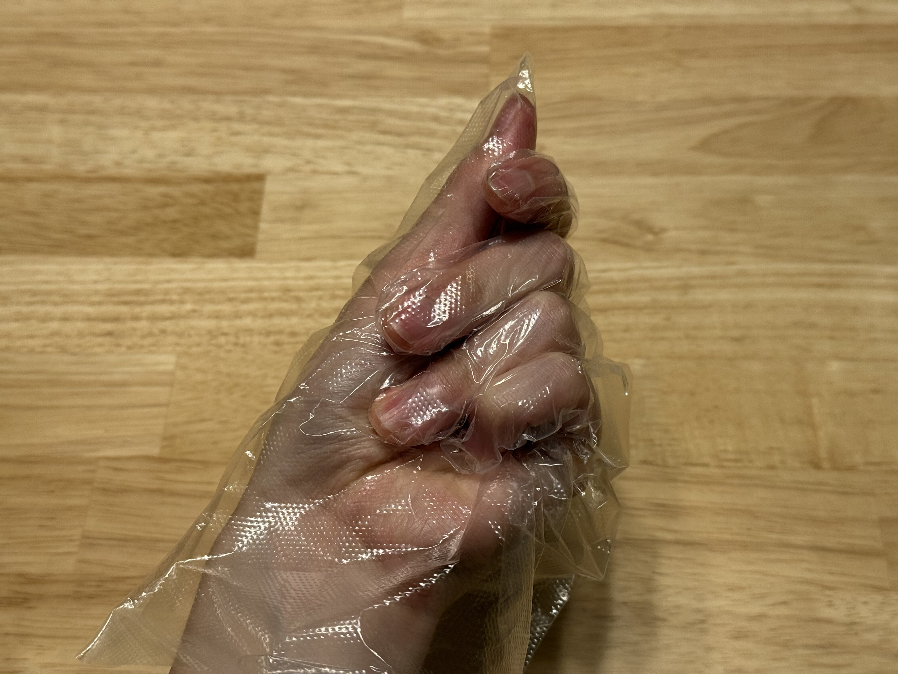
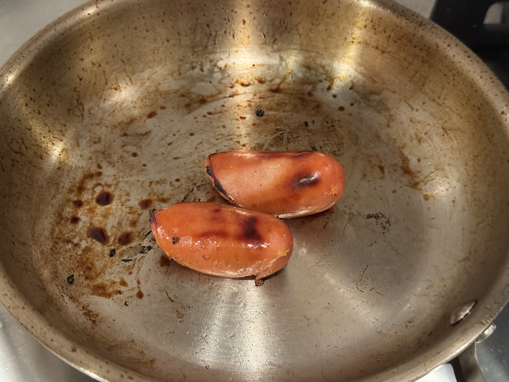

# 【ケチ】限界節約ホットドッグ
### Step -1: 心構え
調理工程は可能な限り、お客様から見えないようにする
#### 料理の優先順位
1. 衛生
2. 見た目
3. 味

### Step 0: 調理に入る前に
1. 使い捨て手袋を装着する    
2. アルコールを両手にかける   
3. 手袋全体がアルコールで湿るように手をこする   
4. アルコールが蒸発するまで待つ

### Step 1: ソーセージの調理
   
   
1. ソーセージを用意する    
2. ソーセージを対角線に合わせてソーセージカッターで切る    　    
3. 鉄板の温度を確認する
   1. 120 度以下 -> **120 度超える**まで待つ
   2. 120 度以上 -> 次のステップに進む
   3. 160 度以上 -> 火を弱める
4. ソーセージを鉄板に乗せて焼く     
5. 軽く焦げ目が付くまで定期的に回転させながら焼く      
   1. 表面温度が必ず**摂氏75度1分**を満たすようにする（神戸西部衛生監督事務所による指導）
   2. 2分を目安に温めれば十分だが激しく焦げ目が付くようであれば早めに加熱をやめる
6. 焦げ目が付いたらソーセージを鉄板の温度が低い場所もしくはアルミバットに移動する   

### Step 2: パンの調理および盛り付け
   
   
1. パンを用意する    
2. 焼き目をつけるためにスリット面を大きく広げる    
2. パンのスリット面が下に向くようにして鉄板に乗せて焼き目をつける(30秒程度)     
3. 底面を下にして焼き目をつける(30秒程度)   
4. 焼かれたパンを容器に移動させる    
4. パンの切断面の右端、左端にレリッシュをドロップする
   1. **注意: 入れすぎると酸っぱくなる**          
   2. 衛生上の観点からスプーンなどは使わずボトルから直接ドロップする
   3. 直径25mmの円形に2箇所で合計5mL程度の量になるように調節する
   4. **回転を重視するため厳密に測りすぎる必要はない**
5. 加熱されたソーセージを取り、パンの切断面に乗せる
   1. **皮側を上に向ける**
   2. ソーセージがパンの端から5mm程度**はみ出てる**ように見えるように   
6. フライドオニオンを小さじ1杯、スリット面の上に振りかける     
7. ケチャップをスリット面の上に周期1/3〜1/4、振幅はスリット面の幅となるような正弦波でかけて、完成    
8. お客様から見えない、邪魔にならない、衛生的な場所に移動させる

### Step 3: 受け渡し
1. 容器を輪ゴムで止める
    1. **注意: ソーセージが入ってない分が上から見えないようにする**    
2. 断面が見えないように、低い位置でお客様に渡す
    1. 例: 名刺を差し出す時と同じぐらい低姿勢
3. **スマイル**
