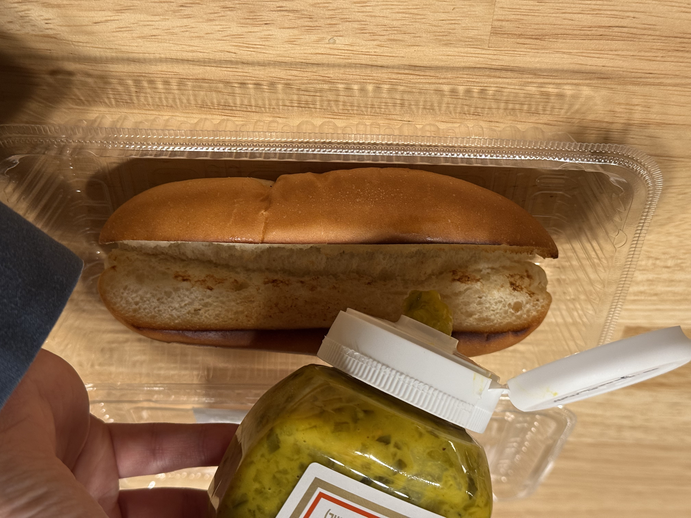

# 【ケチ】限界節約ホットドッグ
### Step -1: 心構え
調理工程は可能な限り、お客様から見えないようにする
#### 料理の優先順位
1. 衛生
2. 見た目
3. 味

### Step 0: 調理に入る前に
1. 使い捨て手袋を装着する    
2. アルコールを両手にかける   
3. 手袋全体がアルコールで湿るように手をこする   
4. アルコールが蒸発するまで待つ

### Step 1: ソーセージの調理
1. ソーセージを用意する    
2. ソーセージを対角線に合わせてソーセージカッターで切る    　    
3. 鉄板の温度を確認する
   1. 75 度以下 -> **75 度超える**まで待つ
   2. 75 度以上 -> 次のステップに進む
   3. 160 度以上 -> 火を弱める
4. ソーセージを鉄板に乗せて焼く     
5. 裏返しながら**1 分以上**焼く      
6. **1 分以上**焼かれたソーセージを鉄板の温度の低い場所に移動させる   

### Step 2: パンの調理および盛り付け
1. パンを用意する    
2. 焼き目をつけるために、切り目が大きく広げる    
2. パンの切断面が下に向くようにして鉄板に乗せて焼き目をつける(約15秒)     
3. 裏返して約15秒焼く   
4. 焼かれたパンを容器に移動させる    
4. パンの切断面の右端、左端にレリッシュをドロップする
   1. **注意: 入れすぎると酸っぱくなる**          
5. 加熱されたソーセージを取り、パンの切断面に乗せる
   1. **皮側を上に向ける**
   2. ソーセージがパンから**はみ出てる**ように見えるように   
6. フライドオニオンを小さじ1杯、容器の端から端まで振り下ろす     
7. ケチャップを容器の端から端まで、3個分の正弦波のようにかけて、完成    
8. お客様から見えない、邪魔にならない、衛生的な場所に移動させる

### Step 3: 受け渡し
1. 容器を輪ゴムで止める
    1. **注意: ソーセージが入ってない分が上から見えないようにする**    
2. 断面が見えないように、低い位置でお客様に渡す
    1. 例: 名刺を差し出す時と同じぐらい低姿勢
3. **スマイル**
